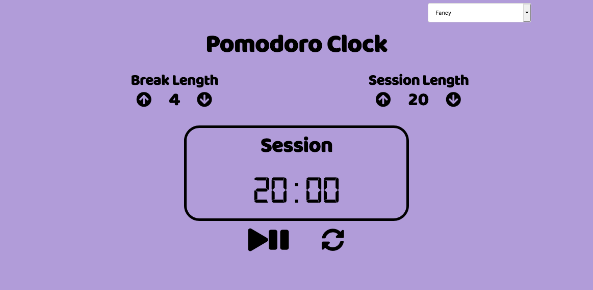

<h1 align="center">Pomodoro Clock</h1>

A responsive pomodoro clock built with JavaScript

## Table of Contents
* [Project Status](#project-status)
* [Features](#features)
* [Screenshots](#screenshots)
* [Technologies](#technologies)
* [Inspirations](#inspirations)
* [Contact](#contact)
* [License](#license)

## Project Status
This project is currently: _Complete_

## Features
Complete:
- [X] Increase or decrease the session and break lengths
- [X] Start and stop the session timer
- [X] Reset the session and break timers back to their original values
- [X] When the session timer ends, the break timer starts
- [X] Alarm sounds when the session timer or break timer ends
- [X] Change the color scheme based on your mood

User Stories Fulfilled:
- [X] User Story #1: I can see an element with id="break-label" that contains a string (e.g. "Break Length")
- [X] User Story #2: I can see an element with id="session-label" that contains a string (e.g. "Session Length")
- [X] User Story #3: I can see two clickable elements with corresponding IDs: id="break-decrement" and id="session-decrement"
- [X] User Story #4: I can see two clickable elements with corresponding IDs: id="break-increment" and id="session-increment"
- [X] User Story #5: I can see an element with a corresponding id="break-length", which by default (on load) displays a value of 5
- [X] User Story #6: I can see an element with a corresponding id="session-length", which by default displays a value of 25
- [X] User Story #7: I can see an element with a corresponding id="timer-label", that contains a string indicating a session is initialized (e.g. "Session")
- [X] User Story #8: I can see an element with corresponding id="time-left". NOTE: Paused or running, the value in this field should always be displayed in mm:ss format (i.e. 25:00)
- [X] User Story #9: I can see a clickable element with a corresponding id="start_stop"
- [X] User Story #10: I can see a clickable element with a corresponding id="reset"
- [X] User Story #11: When I click the element with the id of reset, any running timer should be stopped, the value within id="break-length" should return to 5, the value within id="session-length" should return to 25, and the element with id="time-left" should reset to it's default state
- [X] User Story #12: When I click the element with the id of break-decrement, the value within id="break-length" decrements by a value of 1, and I can see the updated value
- [X] User Story #13: When I click the element with the id of break-increment, the value within id="break-length" increments by a value of 1, and I can see the updated value
- [X] User Story #14: When I click the element with the id of session-decrement, the value within id="session-length" decrements by a value of 1, and I can see the updated value
- [X] User Story #15: When I click the element with the id of session-increment, the value within id="session-length" increments by a value of 1, and I can see the updated value
- [X] User Story #16: I should not be able to set a session or break length to <= 0
- [X] User Story #17: I should not be able to set a session or break length to > 60
- [X] User Story #18: When I first click the element with id="start_stop", the timer should begin running from the value currently displayed in id="session-length", even if the value has been incremented or decremented from the original value of 25
- [X] User Story #19: If the timer is running, the element with the id of time-left should display the remaining time in mm:ss format (decrementing by a value of 1 and updating the display every 1000ms)
- [X] User Story #20: If the timer is running and I click the element with id="start_stop", the countdown should pause
- [X] User Story #21: If the timer is paused and I click the element with id="start_stop", the countdown should resume running from the point at which it was paused
- [X] User Story #22: When a session countdown reaches zero (NOTE: timer MUST reach 00:00), and a new countdown begins, the element with the id of timer-label should display a string indicating a break has begun
- [X] User Story #23: When a session countdown reaches zero (NOTE: timer MUST reach 00:00), a new break countdown should begin, counting down from the value currently displayed in the id="break-length" element
- [X] User Story #24: When a break countdown reaches zero (NOTE: timer MUST reach 00:00), and a new countdown begins, the element with the id of timer-label should display a string indicating a session has begun
- [X] User Story #25: When a break countdown reaches zero (NOTE: timer MUST reach 00:00), a new session countdown should begin, counting down from the value currently displayed in the id="session-length" element
- [X] User Story #26: When a countdown reaches zero (NOTE: timer MUST reach 00:00), a sound indicating that time is up should play. This should utilize an HTML5 audio tag and have a corresponding id="beep"
- [X] User Story #27: The audio element with id="beep" must be 1 second or longer
- [X] User Story #28: The audio element with id of beep must stop playing and be rewound to the beginning when the element with the id of reset is clicked

## Screenshots

## Technologies
Built with:
* HTML
* CSS
* JavaScript

## Inspirations
This project was built as part of freeCodeCamp's [Front End Libraries Certification](https://learn.freecodecamp.org/front-end-libraries/front-end-libraries-projects/build-a-javascript-calculator).

## Contact
Twitter - [@CBStanley12](https://twitter.com/CBStanley12)

DEV - [cbstanley12](https://dev.to/cbstanley12)

## License
**MIT License**: 
A short and simple permissive license with conditions only requiring preservation of copyright and license notices. Licensed works, modifications, and larger works may be distributed under different terms and without source code.